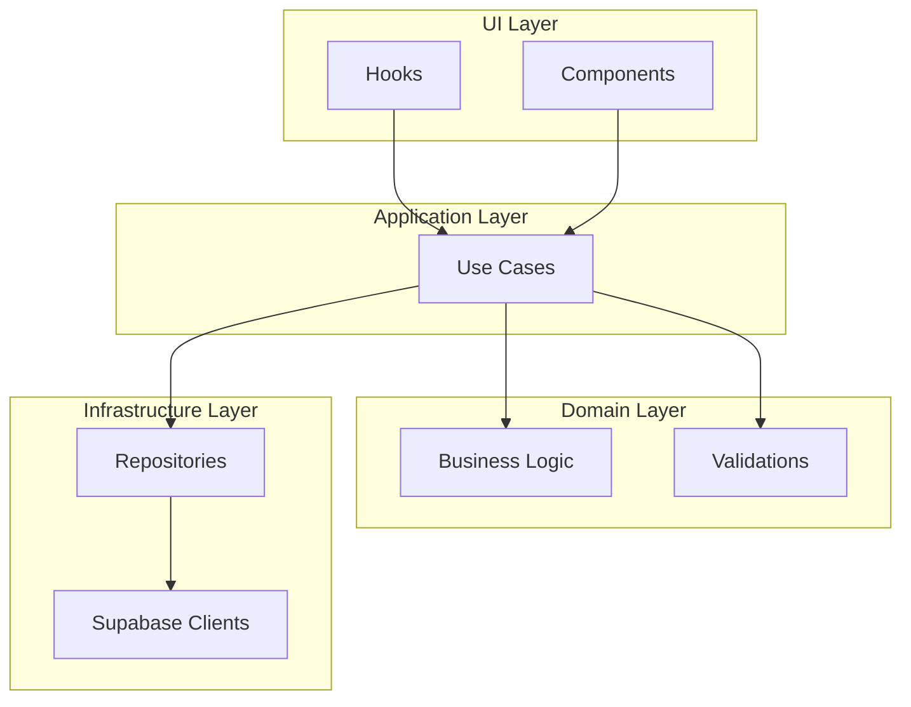

# Arquitectura por Features - Separación de Capas

## Resumen

Este documento explica la nueva arquitectura por features implementada en Fase 1, con separación correcta de responsabilidades por capas.

---

## Problema Resuelto

### ❌ Antes (Problemático)
```
services/supabase/
  ├── budget.ts          # ❌ Mezcla infraestructura + dominio + aplicación
  ├── categoryBudget.ts  # ❌ Usa cliente legacy createSupabaseClient()
  └── transactions.ts    # ❌ Lógica de negocio + acceso a datos juntos
```

**Problemas identificados:**
- Violación del principio de responsabilidad única
- Lógica de negocio mezclada con infraestructura
- Uso de clientes Supabase legacy
- Dificulta testing y mantenimiento
- No escala para múltiples desarrolladores

### ✅ Después (Correcto)
```
features/
  budgets/
    ├── domain/
    │   └── budgetLogic.ts      # 🟢 Lógica de negocio pura
    ├── services/
    │   └── budgetRepository.ts # 🟢 Solo acceso a datos
    ├── application/
    │   └── budgetUseCases.ts   # 🟢 Orquestación de flujos
    └── index.ts                # 🟢 API pública
  transactions/
    ├── domain/
    │   └── transactionLogic.ts
    ├── services/
    │   └── transactionRepository.ts
    ├── application/
    │   └── transactionUseCases.ts
    └── index.ts
```

---

## Separación de Capas

### 🏗️ **INFRASTRUCTURE (services/)**
**Responsabilidad**: Acceso a datos ÚNICAMENTE

```typescript
// ✅ Correcto - Solo queries a Supabase
export class BudgetRepository {
  async findByUserAndPeriod(userId: string, year: number, month: number) {
    const client = await getServerSupabaseClient() // ✅ Nuevo cliente
    return await client.from('presupuestos').select('*')
  }
}

// ❌ Incorrecto - NO debe contener
class BadRepository {
  async getCurrentBudget(userId: string) {
    const now = new Date() // ❌ Lógica de fechas = dominio
    const month = now.getMonth() + 1 // ❌ Cálculos = dominio
    // ...
  }
}
```

### 🧠 **DOMAIN (domain/)**
**Responsabilidad**: Lógica de negocio pura

```typescript
// ✅ Correcto - Lógica pura, sin dependencias
export function getCurrentPeriod(date: Date = new Date()): BudgetPeriod {
  const year = date.getFullYear()
  const month = date.getMonth() + 1
  return { year, month, monthDate: `${year}-${month.padStart(2, '0')}-01` }
}

export function validateBudgetAmount(amount: number): BudgetValidation {
  const errors: string[] = []
  if (amount < 0) errors.push('El monto no puede ser negativo')
  return { isValid: errors.length === 0, errors }
}

// ❌ Incorrecto - NO debe contener
function badDomainFunction() {
  const client = getSupabaseClient() // ❌ Acceso a infraestructura
  localStorage.setItem('key', 'value') // ❌ Efectos secundarios
}
```

### 🎯 **APPLICATION (application/)**
**Responsabilidad**: Orquestar flujos de negocio

```typescript
// ✅ Correcto - Coordina dominio + infraestructura
export class BudgetUseCases {
  async saveBudget(userId: string, amount: number): Promise<Budget> {
    // 1. Validar usando dominio
    const validation = validateBudgetAmount(amount)
    if (!validation.isValid) {
      throw new BudgetApplicationError('Invalid amount', 'INVALID_AMOUNT')
    }

    // 2. Obtener período usando dominio
    const period = getCurrentPeriod()

    // 3. Usar infraestructura para persistir
    const entity = await budgetRepository.create({
      user_id: userId,
      monto_mensual: amount,
      mes: period.month,
      año: period.year
    })

    // 4. Mapear y retornar
    return this.mapEntityToDomain(entity)
  }
}
```

---

## Flujo de Datos

### Arquitectura Hexagonal Implementada



### Flujo de Ejecución

1. **UI** → Llama a casos de uso
2. **Application** → Valida entrada usando dominio
3. **Application** → Ejecuta lógica de negocio (dominio)
4. **Application** → Persiste datos (infraestructura)
5. **Application** → Retorna resultado a UI

---

## Features Implementadas

### 📊 **BUDGETS**

#### Estructura
```
features/budgets/
├── domain/budgetLogic.ts        # Lógica de fechas, validaciones
├── services/budgetRepository.ts # Queries a Supabase
├── application/budgetUseCases.ts # Casos de uso
└── index.ts                     # API pública
```

#### API Pública
```typescript
import { BudgetService, CategoryBudgetService } from '@/features/budgets'

// Presupuestos generales
const budget = await BudgetService.getCurrent(userId)
await BudgetService.save(userId, 1000000)

// Presupuestos por categoría  
const summary = await CategoryBudgetService.getSummary(userId, getExpensesByCategory)
await CategoryBudgetService.save(userId, 'Alimentación', 500000)
```

#### Casos de Uso Disponibles
- `getCurrentBudget()` - Obtener presupuesto actual
- `getBudgetByPeriod()` - Obtener presupuesto específico
- `saveBudget()` - Crear/actualizar presupuesto
- `getAllBudgets()` - Obtener todos los presupuestos
- `getCategoryBudgetSummary()` - Resumen por categorías
- `saveCategoryBudget()` - Guardar presupuesto por categoría
- `deleteCategoryBudget()` - Eliminar presupuesto por categoría

### 💰 **TRANSACTIONS**

#### Estructura
```
features/transactions/
├── domain/transactionLogic.ts        # Validaciones, cálculos
├── services/transactionRepository.ts # Queries a Supabase
├── application/transactionUseCases.ts # Casos de uso
└── index.ts                          # API pública
```

#### API Pública
```typescript
import { TransactionService } from '@/features/transactions'

// Consultas
const transactions = await TransactionService.getMonthly(userId)
const summary = await TransactionService.getCategorySummary(userId)
const weeklyData = await TransactionService.getWeeklySummary(userId)

// Operaciones
await TransactionService.create({
  userId,
  amount: 50000,
  category: 'Alimentación',
  type: 'gasto',
  description: 'Supermercado'
})

await TransactionService.delete(transactionId, userId)
```

#### Casos de Uso Disponibles
- `getMonthlyTransactions()` - Transacciones del mes
- `getCategorySummary()` - Resumen por categorías
- `getWeeklySummary()` - Resumen semanal
- `getMonthlySpent()` - Total gastado en el mes
- `getMonthlyIncome()` - Total ingresos en el mes
- `getExpensesByCategory()` - Gastos agrupados por categoría
- `createTransaction()` - Crear nueva transacción
- `deleteTransaction()` - Eliminar transacción
- `getTransactionById()` - Obtener transacción específica

---

## Migración desde Código Legacy

### Hooks Existentes → Nueva Arquitectura

#### Antes (useBudget.ts)
```typescript
// ❌ Mezclaba todo en un hook
export const useBudget = () => {
  const supabase = createSupabaseClient() // ❌ Cliente legacy
  
  const loadBudgetFromSupabase = async (userId: string) => {
    const now = new Date() // ❌ Lógica de dominio en hook
    const currentMonth = now.getMonth() + 1 // ❌ Cálculos en hook
    
    const { data, error } = await supabase // ❌ Query directo en hook
      .from('presupuestos')
      .select('*')
      .eq('user_id', userId)
    // ...
  }
}
```

#### Después (Separado por capas)
```typescript
// ✅ Hook solo maneja UI state
export const useBudget = (userId: string) => {
  const [budget, setBudget] = useState<Budget | null>(null)
  const [loading, setLoading] = useState(true)
  
  useEffect(() => {
    const loadBudget = async () => {
      try {
        setLoading(true)
        // ✅ Usa caso de uso, no acceso directo
        const currentBudget = await BudgetService.getCurrent(userId)
        setBudget(currentBudget)
      } catch (error) {
        console.error('Error loading budget:', error)
      } finally {
        setLoading(false)
      }
    }
    
    loadBudget()
  }, [userId])
  
  const saveBudget = useCallback(async (amount: number) => {
    // ✅ Delega al caso de uso
    const saved = await BudgetService.save(userId, amount)
    setBudget(saved)
  }, [userId])
  
  return { budget, loading, saveBudget }
}
```

---

## Beneficios de la Nueva Arquitectura

### 🧪 **Testing Mejorado**
```typescript
// ✅ Fácil de testear - funciones puras
describe('Budget Domain Logic', () => {
  test('validateBudgetAmount should reject negative amounts', () => {
    const result = validateBudgetAmount(-100)
    expect(result.isValid).toBe(false)
    expect(result.errors).toContain('El monto no puede ser negativo')
  })
})

// ✅ Casos de uso mockeables
describe('Budget Use Cases', () => {
  test('saveBudget should validate amount before saving', async () => {
    const mockRepo = { create: jest.fn() }
    const useCases = new BudgetUseCases(mockRepo)
    
    await expect(useCases.saveBudget('user1', -100))
      .rejects.toThrow('Invalid amount')
    
    expect(mockRepo.create).not.toHaveBeenCalled()
  })
})
```

### 🔄 **Reutilización de Código**
```typescript
// ✅ Lógica de dominio reutilizable
const period = getCurrentPeriod() // Usado en budgets Y transactions
const validation = validateBudgetAmount(1000) // Usado en múltiples casos de uso

// ✅ Repositorios reutilizables
const budgets = await budgetRepository.findAllByUser(userId) // Usado en múltiples casos de uso
```

### 👥 **Trabajo en Equipo**
- **Frontend Dev**: Solo toca hooks y componentes
- **Backend Dev**: Solo toca repositorios y casos de uso
- **Business Analyst**: Solo revisa lógica de dominio
- **QA**: Puede testear cada capa independientemente

### 📈 **Escalabilidad**
- Agregar nueva feature = nueva carpeta en `features/`
- Cambiar BD = solo tocar repositorios
- Cambiar reglas de negocio = solo tocar dominio
- Cambiar UI = solo tocar presentation layer

---

## Próximos Pasos

### Fase 2: Migrar Hooks Existentes
1. Actualizar `useBudget.ts` para usar `BudgetService`
2. Actualizar `useTransactions.ts` para usar `TransactionService`
3. Actualizar `useCategories.ts` para usar nueva arquitectura

### Fase 3: Feature Auth
```
features/auth/
├── domain/authLogic.ts
├── services/authRepository.ts
├── application/authUseCases.ts
└── index.ts
```

### Fase 4: Eliminar Código Legacy
1. Remover `utils/supabase/` (ya no se usa)
2. Consolidar tipos duplicados
3. Optimizar imports

---

## Guía de Uso

### Para Desarrolladores Frontend
```typescript
// ✅ Importar desde features
import { BudgetService } from '@/features/budgets'
import { TransactionService } from '@/features/transactions'

// ✅ Usar en hooks
const budget = await BudgetService.getCurrent(userId)
const transactions = await TransactionService.getMonthly(userId)
```

### Para Desarrolladores Backend
```typescript
// ✅ Extender repositorios
export class BudgetRepository {
  async findByCustomCriteria() {
    const client = await getServerSupabaseClient()
    // Nueva funcionalidad
  }
}

// ✅ Agregar casos de uso
export class BudgetUseCases {
  async getAnnualBudget(userId: string) {
    // Nuevo caso de uso
  }
}
```

### Para Testing
```typescript
// ✅ Testear dominio (funciones puras)
import { validateBudgetAmount } from '@/features/budgets'

// ✅ Testear casos de uso (mockear repositorios)
import { budgetUseCases } from '@/features/budgets'

// ✅ Testear repositorios (mockear Supabase)
import { budgetRepository } from '@/features/budgets'
```

---

**La nueva arquitectura por features con separación de capas proporciona una base sólida, mantenible y escalable para el crecimiento futuro del proyecto.**

---

*Documento actualizado: Diciembre 2025*  
*Próxima revisión: Inicio de Fase 2*
